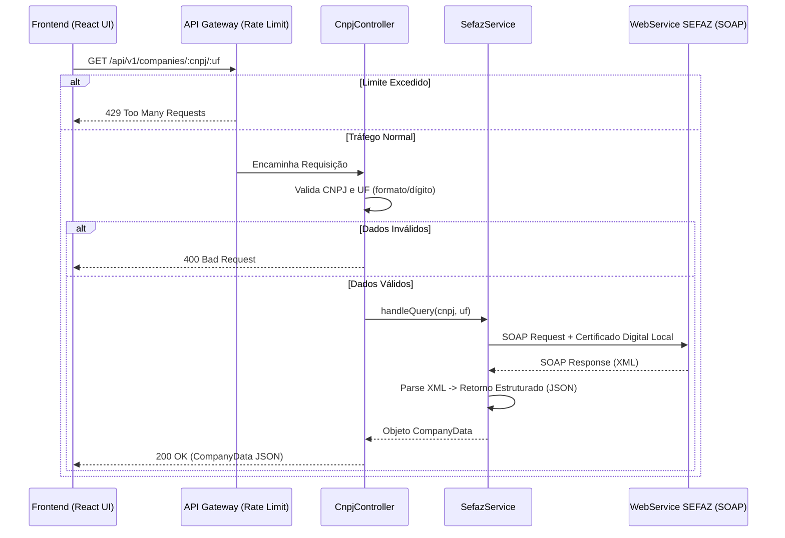

# System Requirements Document (SRD)

> Referência de Origem: [PRD.md](../PRD.md)

## 1. Visão Geral da Arquitetura

A arquitetura baseia-se num sistema Monorepo contendo uma API REST desenvolvida em Node.js (Express com MVC) e uma aplicação Frontend integrada (React + Tailwind). O frontend injeta uma consulta no backend, e este intermedeia a validação SOAP junto à SEFAZ de forma segura.



## 2. Estrutura MVC e Frontend Coabitado

- **Frontend (`src/components`, `src/pages`)**: Encapsula UI, validadores visuais e a montagem do formulário de entrada.
- **Controller (`src/controllers`)**: Primeira camada backend. Recebe os parâmetros, valida a integridade da entrada (CNPJ e UF), invoca a camada Service e formata o HTTP response.
- **Service (`src/services`)**: Contém a regra de negócio/infraestrutura. Lê o Certificado Digital físico, resolve o envelope XML, e aplica parse do XML Sefaz num JSON plano.
- **Interfaces (`src/interfaces`)**: Define os contratos entre Client/Server, como por exemplo a interface `CompanyData`.

## 3. Contrato da API (Endpoints)

### GET `/api/v1/companies/:cnpj/:uf`

**Descrição**: Consulta a situação cadastral de um CNPJ em uma UF específica.

**Códigos de Retorno Esperados**:

- **200 OK**: Dados extraídos com sucesso.
  ```json
  {
    "cnpj": "00.000.000/0000-00",
    "razaoSocial": "EMPRESA DE EXEMPLO LTDA",
    "nomeFantasia": "EXEMPLO",
    "situacaoCadastral": "Ativa",
    "dataAbertura": "2020-01-01",
    "cnaePrincipal": "0000-0/00 - Atividade Principal",
    "endereco": "RUA TESTE, 123 - CENTRO - SÃO PAULO/SP"
  }
  ```
- **400 Bad Request**: Formato do CNPJ incorreto ou dígito inválido.
- **404 Not Found**: Base estadual Sefaz responde que CNPJ não existe.
- **429 Too Many Requests**: Cota de acessos do IP pelo Rate Limit estourada.
- **500 Internal Server Error**: Erro interno do servidor (Ex: Arquivo do Certificado ausente, Senha inválida no `.env`, ou certificado vencido).
- **502 Bad Gateway**: O WebService da SEFAZ respondeu com um SOAP Fault externo inesperado.
- **504 Gateway Timeout**: A SEFAZ demorou excessivamente para responder.

## 4. Integração SOAP e Certificado Digital

O backend fará a negociação mTLS direta com proteção de ponta a ponta.

- **Armazenamento do Certificado**: Ficará exclusivamente **hospedado no lado do servidor (API)**. O modelo presumido é arquivo A1 (tipo `.pfx` ou `.p12`).
- **Variáveis de Ambiente (`.env`)**: A API não guardará o caminho ou a senha em hardcode. As variáveis base serão `CERT_PATH` (caminho absoluto ou relativo confiável do arquivo) e `CERT_PASS` (senha do certificado de produção).
- **Bibliotecas SOAP**: O parser utilizará `soap` ou `strong-soap` provendo opções M2M (metadados HTTPS associados com o TLS Client Auth).
- **Tratamento de Exceções XML**: Erros mapeados por mensagens dentro do envelopamento XML de Sucesso serão interpretados no Service e transformados num 400 ou 404 dependendo do "Motivo Rejeição".

## 5. Segurança e Validações

- **Rate Limit**: Middleware do Express (`express-rate-limit` recomendado). Limitado a **10 requisições por IP a cada 1 minuto**. Protege o gateway do Estado contra blocklisting pelo Certificado da nossa empresa.
- **CNPJ e UF**: Verificação algorítmica lógica RFB no backend, impedindo disparo cego de requisições que se sabe que darão falha perante a SEFAZ de antemão.

## 6. Requisitos Não-Funcionais

- **Timeout (SEFAZ)**: Restrito a **15 segundos**. Gera um 504 no timeout, liberando as theads.
- **Resposta Genérica de Erro**: `{ "error": "NomeDoErro", "message": "Descrição contextual PT-BR" }`.
- **Sem Cache**: Nenhuma retenção interna além da sessão TCP/SOAP. Tudo é on-the-fly.

## 7. Estrutura de Pastas (Monorepo Node)

```text
sefaz-cnpj-v3/
├── .env                      --> Define caminho do certificado, portas, senhas.
├── .context/
│   └── srd.md
├── certs/                    --> Local onde o certificado é posto no servidor (ignorados no git)
├── src/
│   ├── api/
│   │   ├── controllers/      --> Endpoints e RateLimiter attachment
│   │   ├── services/         --> Rotina SOAP e Certificado
│   │   ├── utils/            --> cnpjValidator e parsers
│   │   └── app.ts            --> Setup do HTTP, Rate Limit
│   ├── components/           --> React UI Forms (CompanyForm)
│   ├── pages/                --> React Pages (ConsultaCnpj)
│   ├── interfaces/           --> CompanyData.ts e configs
│   └── App.tsx               --> Ponto de entrada React
```

_// Spec: Rastros de requisitos originados do PRD v1.1. Tratamento seguro de Certificados focado em backend isolation._
